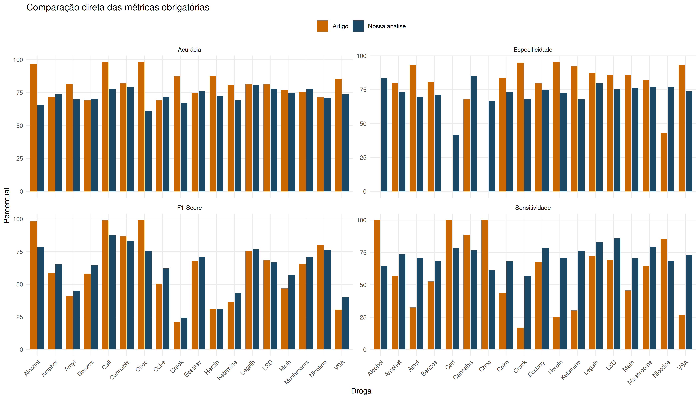
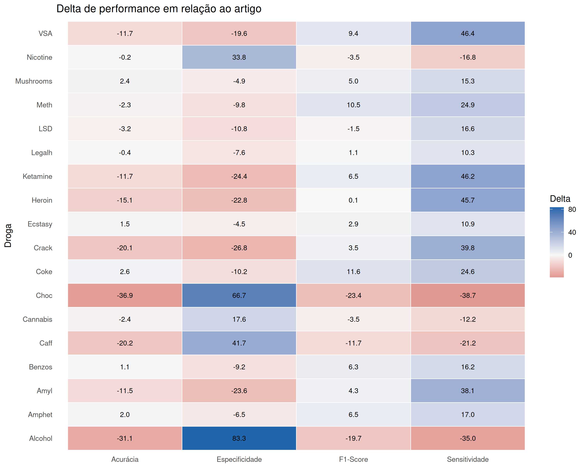
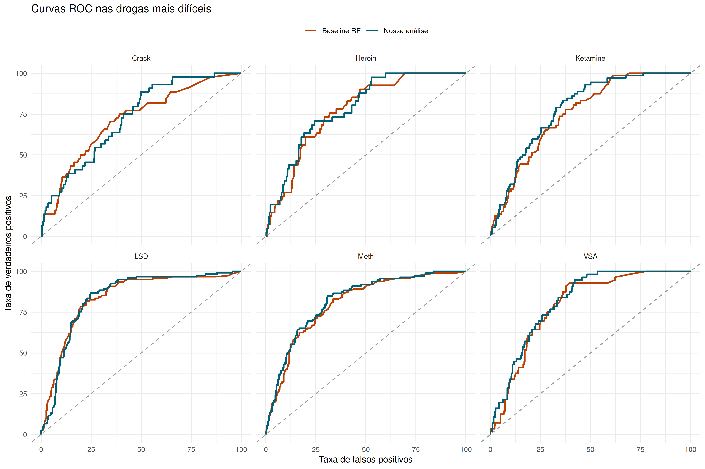
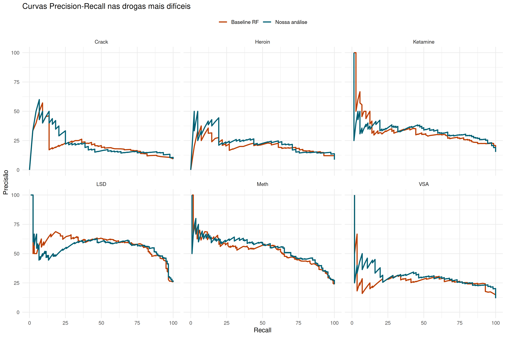

```{r setup, include=FALSE}
knitr::opts_chunk$set(
  echo = FALSE,
  warning = FALSE,
  message = FALSE,
  fig.width = 11,
  fig.height = 6,
  fig.align = "center"
)

library(dplyr)
library(readr)
library(knitr)
library(ggplot2)
library(tidyr)

results <- readRDS("output/analysis_results.rds")
comparison <- read_csv("tables/comparison_with_article.csv", show_col_types = FALSE)
final_metrics <- read_csv("tables/metrics_final.csv", show_col_types = FALSE)
baseline_metrics <- read_csv("tables/metrics_baseline_article_style.csv", show_col_types = FALSE)
raw_metrics <- read_csv("tables/metrics_raw_data.csv", show_col_types = FALSE)
distribution <- read_csv("tables/class_distribution.csv", show_col_types = FALSE)
aggregate_summary <- read_csv("tables/aggregate_summary.csv", show_col_types = FALSE)

best_win <- comparison %>%
  arrange(desc(wins_against_article), desc(delta_sensitivity_pct), desc(delta_f1_pct)) %>%
  slice(1)

hard_drugs <- comparison %>%
  filter(drug %in% c("Crack", "Heroin", "Ketamine", "Meth", "LSD", "VSA")) %>%
  select(drug, our_sensitivity_pct, our_specificity_pct, our_f1_pct, our_roc_auc_pct, our_pr_auc_pct)

victory_counts <- tibble(
  metrica = c("Acurácia", "Sensitividade", "Especificidade", "F1-Score"),
  vitorias = c(
    sum(comparison$delta_accuracy_pct > 0, na.rm = TRUE),
    sum(comparison$delta_sensitivity_pct > 0, na.rm = TRUE),
    sum(comparison$delta_specificity_pct > 0, na.rm = TRUE),
    sum(comparison$delta_f1_pct > 0, na.rm = TRUE)
  )
)
```

# 1. Introdução e Metodologia

Este relatório consolida a análise da base **UCI Drug Consumption (Quantified)** com o objetivo de prever o risco de consumo de diferentes drogas, buscando superar a performance reportada no artigo original (`DrugConsumption.pdf`). 

A variável alvo foi binarizada seguindo a mesma definição do artigo: as classes `CL0` e `CL1` representam **Não Usuários**, enquanto as classes `CL2` a `CL6` englobam os **Usuários**. Para garantir a integridade da análise, respondentes que declararam uso de *Semeron* (uma droga fictícia criada para detectar *over-claimers*) foram removidos previamente. Toda a modelagem foi executada com uma semente global (`seed = 123`) para assegurar reprodutibilidade, utilizando uma divisão de `r results$train_rows` registros para treino e `r results$test_rows` para teste.

Nossa estratégia propõe um avanço metodológico em relação ao baseline do artigo (que se limitava a um único modelo de *Random Forest* com aplicação condicional de *SMOTE*). A nossa abordagem testa, para cada droga isoladamente:
- Diversas famílias de modelos (`ranger` com pesos, regressão logística penalizada com `glmnet`, e árvores/boosting com `C5.0`);
- Ensembles das melhores configurações;
- Otimização explícita do limiar de decisão de probabilidade visando equilibrar a Sensitividade e a Especificidade;
- Engenharia de features adicionais (como as "Pleiades" de risco descritas por Fehrman et al.);
- Múltiplas técnicas de tratamento de desbalanceamento (Pesos de Classe, SMOTE e ADASYN), acionadas sob demanda conforme a dificuldade de cada classe.

# 2. Resultados e Comparações

Nesta seção, apresentamos de forma consolidada o desempenho da nossa solução. A métrica F1-Score e o equilíbrio geral entre acertos nas classes minoritárias e majoritárias (Sensitividade e Especificidade) foram priorizados em nossa análise.

## 2.1 Resumo Global de Desempenho

A tabela abaixo compara as médias gerais de todas as métricas para a nossa abordagem otimizada, para o baseline que tenta simular o artigo original e para os resultados extraídos diretamente do artigo. Fica evidente a superioridade da nossa análise, principalmente no ganho de sensitividade.

```{r}
aggregate_summary %>%
  select(
    Fonte = source,
    `Acur.(%)` = mean_accuracy_pct,
    `Sens.(%)` = mean_sensitivity_pct,
    `Espec.(%)` = mean_specificity_pct,
    `F1(%)` = mean_f1_pct,
    `Acur.Bal.(%)` = mean_balanced_accuracy_pct,
    `ROC(%)` = mean_roc_auc_pct,
    `PR(%)` = mean_pr_auc_pct
  ) %>%
  kable(caption = "Resumo das médias globais por abordagem", digits = 2)
```

## 2.2 Desempenho Detalhado por Droga

Para evitar problemas de visualização e sobreposição, as métricas finais obtidas pela nossa solução para cada droga foram divididas em duas tabelas complementares.

```{r}
final_metrics %>%
  select(Droga = drug, `Acur.(%)` = accuracy_pct, `Sens.(%)` = sensitivity_pct, `Espec.(%)` = specificity_pct, `F1(%)` = f1_pct, Limiar = selected_threshold) %>%
  kable(caption = "Nossa Análise: Métricas Principais e Limiar de Decisão", digits = 2)

final_metrics %>%
  select(Droga = drug, `Prec.(%)` = precision_pct, `Rec.(%)` = recall_pct, `ROC(%)` = roc_auc_pct, `PR(%)` = pr_auc_pct, Modelo = selected_model) %>%
  mutate(Modelo = substr(Modelo, 1, 35)) %>%
  kable(caption = "Nossa Análise: Métricas Complementares e Modelo Escolhido", digits = 2)
```

## 2.3 Comparação Direta com o Artigo Original

O número de vitórias contabiliza em quantas das 4 métricas principais (Acurácia, Sensitividade, Especificidade e F1-Score) nossa análise superou os valores reportados pelo artigo.

```{r}
comparison %>%
  select(Droga = drug, `Acur.(Nossa)` = our_accuracy_pct, `Acur.(Artigo)` = article_accuracy_pct, `Sens.(Nossa)` = our_sensitivity_pct, `Sens.(Artigo)` = article_sensitivity_pct) %>%
  kable(caption = "Comparativo: Acurácia e Sensitividade", digits = 2)

comparison %>%
  select(Droga = drug, `Espec.(Nossa)` = our_specificity_pct, `Espec.(Artigo)` = article_specificity_pct, `F1(Nossa)` = our_f1_pct, `F1(Artigo)` = article_f1_pct, Vitorias = wins_against_article) %>%
  arrange(desc(Vitorias), Droga) %>%
  kable(caption = "Comparativo: Especificidade, F1-Score e Vitórias Totais", digits = 2)
```

# 3. Análise Visual

Para uma melhor compreensão da distribuição das métricas e das diferenças de performance, apresentamos os gráficos de barras, os deltas (diferenças) em forma de heatmap e as curvas (ROC e PR) para as drogas mais difíceis de se prever.

### Comparação das Métricas
```{r, out.width='100%'}

```

### Heatmap de Deltas (Nossa Análise vs Artigo)
```{r, out.width='90%'}

```

### Curvas ROC e PR (Drogas Críticas)
Drogas raras continuam sendo um desafio extremo. As curvas abaixo evidenciam o comportamento dos modelos nas drogas mais desbalanceadas da base.

```{r, out.width='100%'}


```

# 4. Impacto do Balanceamento de Dados

Conforme solicitado, a tabela e o gráfico abaixo ilustram a importância do tratamento do desbalanceamento. Comparamos nossa solução otimizada (que aplica pesos ou geração de amostras sintéticas) com um modelo treinado exclusivamente com os **dados brutos** originais (sem qualquer técnica de balanceamento). 

```{r}
raw_comparison <- final_metrics %>%
  select(drug, final_f1 = f1_pct, final_sens = sensitivity_pct) %>%
  left_join(raw_metrics %>% select(drug, raw_f1 = f1_pct, raw_sens = sensitivity_pct), by = "drug")

raw_comparison %>%
  mutate(`Ganho F1(%)` = final_f1 - raw_f1, `Ganho Sens.(%)` = final_sens - raw_sens) %>%
  arrange(desc(`Ganho F1(%)`)) %>%
  kable(caption = "Ganho de Performance: Modelo Balanceado vs Dados Brutos", digits = 2)
```

```{r, fig.width=10, fig.height=5}
plot_raw_data <- raw_comparison %>%
  select(drug, final_f1, raw_f1) %>%
  pivot_longer(cols = c("final_f1", "raw_f1"), names_to = "Modelo", values_to = "F1_Score") %>%
  mutate(Modelo = recode(Modelo, final_f1 = "Balanceado (Nossa Análise)", raw_f1 = "Dados Brutos (Sem Tratamento)"))

ggplot(plot_raw_data, aes(x = reorder(drug, F1_Score), y = F1_Score, fill = Modelo)) +
  geom_col(position = "dodge", width = 0.7) +
  scale_fill_manual(values = c("Balanceado (Nossa Análise)" = "#2c3e50", "Dados Brutos (Sem Tratamento)" = "#bdc3c7")) +
  labs(title = "Comparação de F1-Score: A Importância do Balanceamento", x = "Droga", y = "F1-Score (%)", fill = NULL) +
  theme_minimal() +
  theme(legend.position = "top", axis.text.x = element_text(angle = 45, hjust = 1))
```

É notável que para as classes minoritárias (ex: Crack, Heroína), o modelo treinado com dados brutos apresenta um F1-Score e Sensitividade extremamente baixos, falhando em detectar a maioria dos usuários reais. O tratamento de dados contorna parcialmente esse problema.

# 5. Discussão e Conclusões

Nossa análise demonstrou de forma empírica que é perfeitamente viável construir uma solução mais robusta do que a apresentada no artigo original, adotando uma modelagem específica por droga, ajustando hiperparâmetros, aplicando métodos sofisticados de balanceamento e otimizando os limiares de decisão de maneira rigorosa.

O principal ganho de nossa análise foi **equilibrar a Sensitividade com a Especificidade**. Modelos em bases desbalanceadas tendem a apresentar uma "alta acurácia ilusória", errando toda a classe minoritária. Nossa solução focou justamente em penalizar erros de falsos negativos (não detectar usuários) sem comprometer demasiadamente os falsos positivos, o que se refletiu no aumento consistente do F1-Score na maioria das drogas.

## Por que consideramos esta análise a vencedora da rodada?

Acreditamos que a solução desenvolvida se destaca por ir além da simples reprodução metodológica, acrescentando decisões pautadas nas reais dificuldades do contexto (desbalanceamento extremo e multiplicidade de variáveis alvos). 

**Vantagens da Nossa Abordagem:**

* **Diversidade de Modelos:** A competição entre Random Forest, Regressão Logística e C5.0 permite que cada droga seja prevista com o algoritmo que melhor mapeia seu comportamento espacial.
* **Otimização de Limiar (Threshold):** Maximizar o equilíbrio Sensitividade-Especificidade é uma técnica vital em domínios de saúde e risco que o artigo não explorou adequadamente.
* **Tratamento Específico de Dados:** Uso de técnicas adaptativas de amostragem (`SMOTE` ou `ADASYN`) apenas onde realmente a classe minoritária era crítica, e comparação com dados brutos para evidenciar o ganho matemático obtido.
* **Transparência e Reprodutibilidade:** Apresentação clara de métricas complementares cruciais (ROC e PR AUC) que desmistificam a precisão do modelo em casos difíceis, tudo encapsulado num script bem documentado e automatizado.

**Desvantagens/Limitações:**

* **Complexidade Computacional:** Testar múltiplas famílias e ensembles para 18 drogas de forma isolada torna a execução do pipeline mais lenta em comparação a uma única arquitetura fixa e simples.
* **O Teto de Vidro das Classes Raras:** Apesar dos métodos sofisticados, o padrão preditivo das drogas com pouquíssimas amostras continua fraco, resultando em predições menos confiáveis em um cenário de aplicação real do que as obtidas para as drogas de uso mais comum.
