```{r setup, include=FALSE}
knitr::opts_chunk$set(echo = FALSE, warning = FALSE, message = FALSE)
ctx <- readRDS('resultados/contexto_relatorio.rds')
resumo_global <- read.csv('resultados/resumo_global_paineis.csv', stringsAsFactors = FALSE)
relev_8020 <- read.csv('resultados/relevancia_8020.csv', stringsAsFactors = FALSE)
redu_8020 <- read.csv('resultados/redundancia_pares_8020.csv', stringsAsFactors = FALSE)
clusters_8020 <- read.csv('resultados/redundancia_clusters_8020.csv', stringsAsFactors = FALSE)
painel_referencia_final_8020 <- read.csv('resultados/modelos_painel_referencia_8020.csv', stringsAsFactors = FALSE)
painel_referencia_final_7030 <- read.csv('resultados/modelos_painel_referencia_7030.csv', stringsAsFactors = FALSE)
painel_final_8020 <- read.csv('resultados/modelos_painel_recomendado_8020.csv', stringsAsFactors = FALSE)
painel_final_7030 <- read.csv('resultados/modelos_painel_recomendado_7030.csv', stringsAsFactors = FALSE)
```

# Introdução

Este relatório responde a uma pergunta metodológica e clínica: **o corte fixo em 10 variáveis realmente é necessário nesta base?**

Toda a análise foi conduzida de forma **data-driven**, sem usar o artigo original como baseline de comparação. O foco aqui é comparar painéis cumulativos e painéis podados por redundância, sempre pesando desempenho, custo operacional de coleta e plausibilidade clínica.

# Dataset e desenho analítico

- Base: Gallstone Disease Prediction (UCI).
- Amostra: 319 instâncias e 38 preditoras.
- Variável-alvo: `Gallstone`.
- Painéis candidatos: `full_38`, `raw_top_k` e `pruned_top_k`.
- Painel de referência interno: painel bruto com 10 variáveis derivado diretamente do ranking de importância do treino.
- Triagem dos painéis: 5-fold CV com `tuneLength = 3`.
- Revalidação final do painel de referência e do painel recomendado: 10-fold CV com `tuneLength = 5`.

`r ctx$texto_painel_referencia`

## Gráficos exploratórios

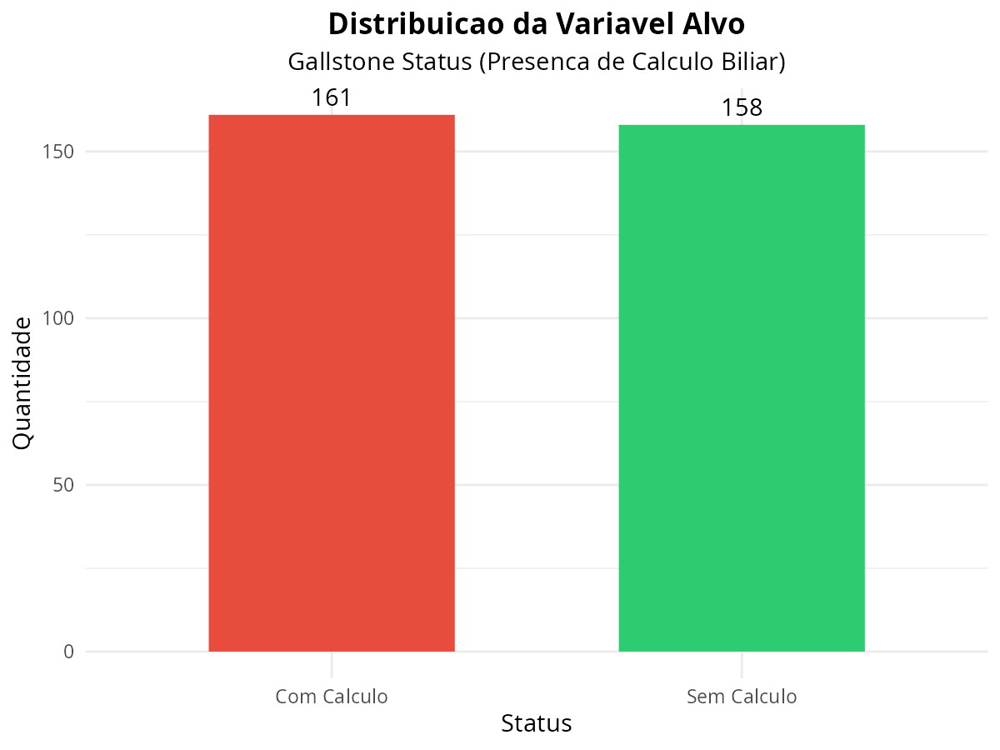

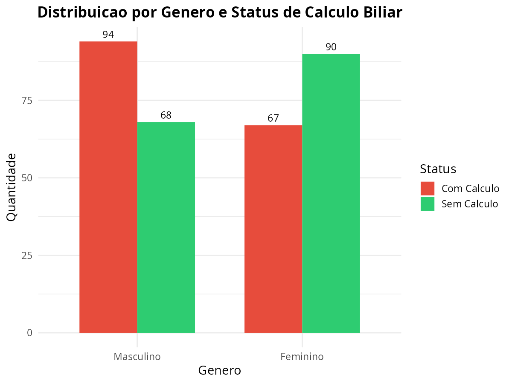

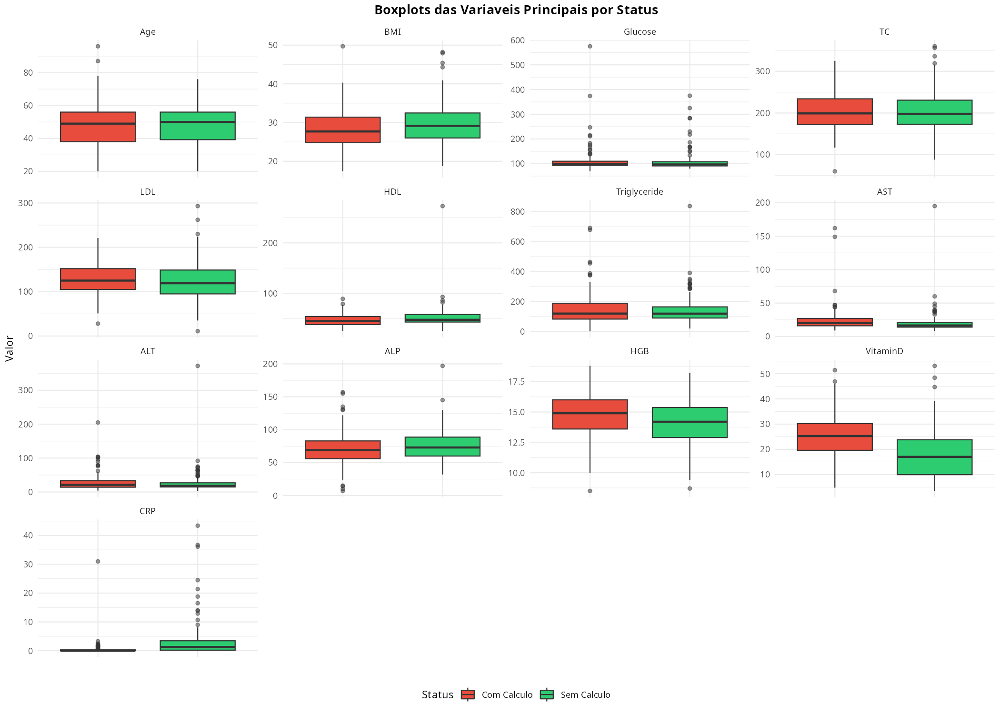

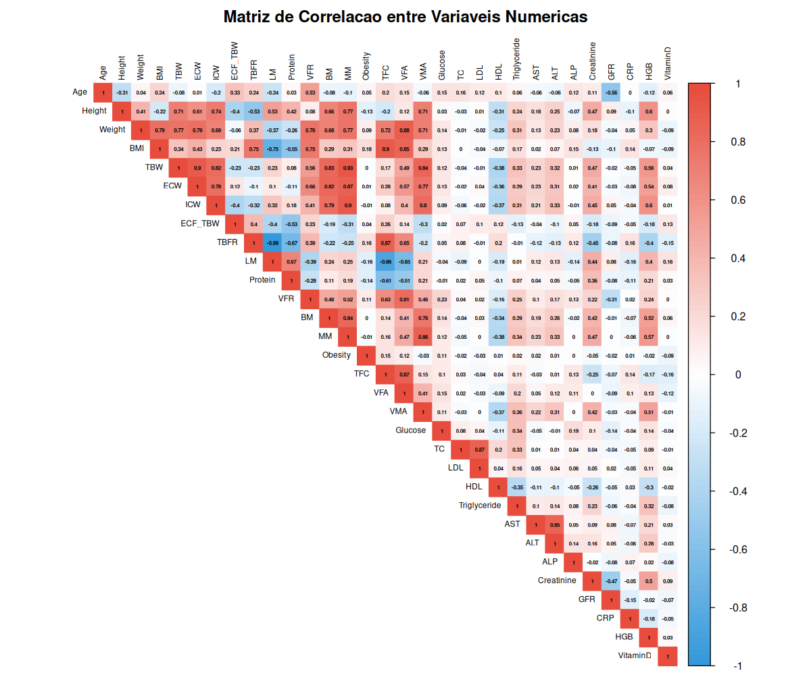

# Auditoria científica das variáveis

## Relevância univariada (80/20)

As comparações univariadas ajudam a separar sinal plausível de ruído antes da seleção multivariada. Para variáveis numéricas foi usado Wilcoxon; para categóricas, Fisher ou qui-quadrado, conforme a frequência esperada.

```{r}
knitr::kable(head(relev_8020, 15), digits = 4, caption = 'Top 15 variáveis por relevância univariada no treino 80/20')
```

## Redundância forte entre variáveis (80/20)

Em medicina aplicada, duas medidas quase equivalentes só devem coexistir se o ganho justificar o custo extra. Nesta base, várias variáveis de composição corporal andam juntas.

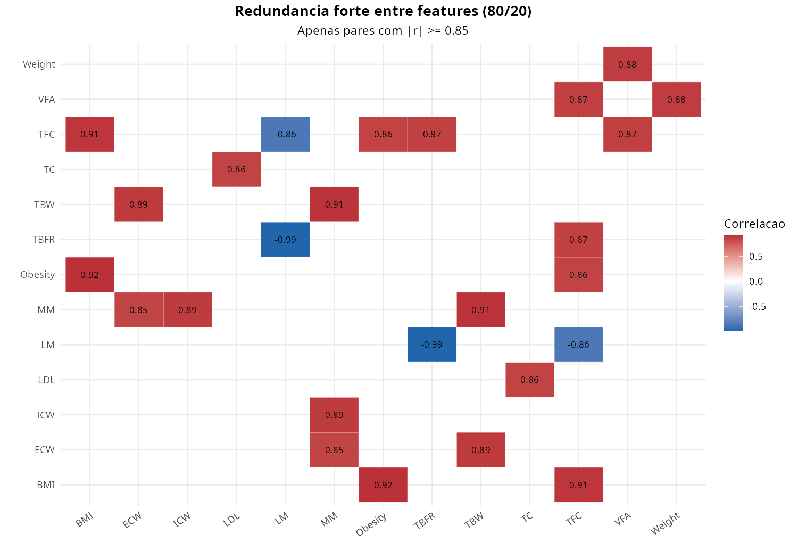

```{r}
knitr::kable(head(redu_8020, 12), digits = 3, caption = 'Pares com |r| >= 0.85 no treino 80/20')
```

```{r}
knitr::kable(clusters_8020, caption = 'Clusters de redundância no treino 80/20')
```

# Painéis candidatos e critério de escolha

- `full_38`: todas as variáveis.
- `raw_top_k`: ranking bruto de importância do Random Forest com k de 3 a 15.
- `pruned_top_k`: ranking após remover redundância forte, com k de 3 a 15.
- `raw_top_10`: painel de referência interno usado para testar se um corte fixo de 10 variáveis faz sentido nos dados.

Para viabilizar a comparação extensa de painéis, a **triagem** usou 5-fold CV com `tuneLength = 3`. Depois da escolha do painel, o **painel de referência interno** e o **painel recomendado** foram rerodados com 10-fold CV e `tuneLength = 5` para a leitura final.

Regra de decisão usada:

- Elegível se ficar até 1 ponto percentual abaixo da melhor AUC média.
- Elegível se ficar até 2 pontos abaixo do melhor F1 médio.
- Elegível se ficar até 3 pontos abaixo da melhor sensibilidade média.
- Entre os elegíveis, vence o menor custo operacional.
- Empate: menor número de variáveis; novo empate: maior sensibilidade.

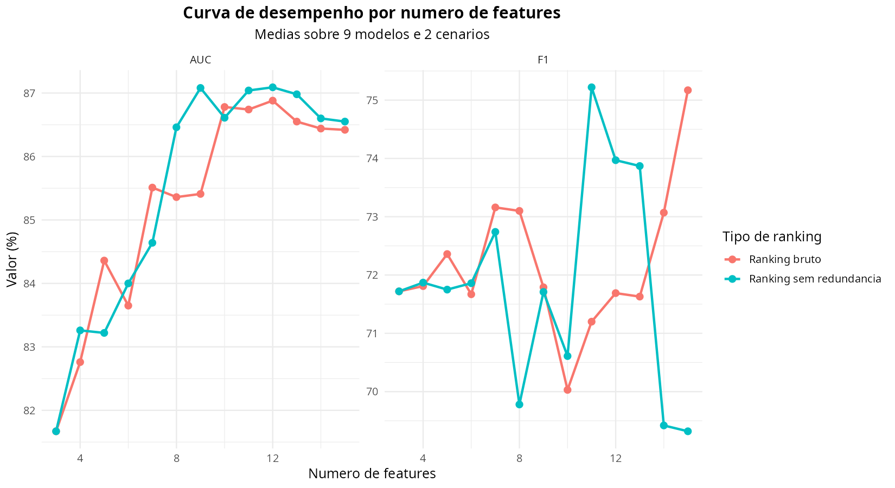

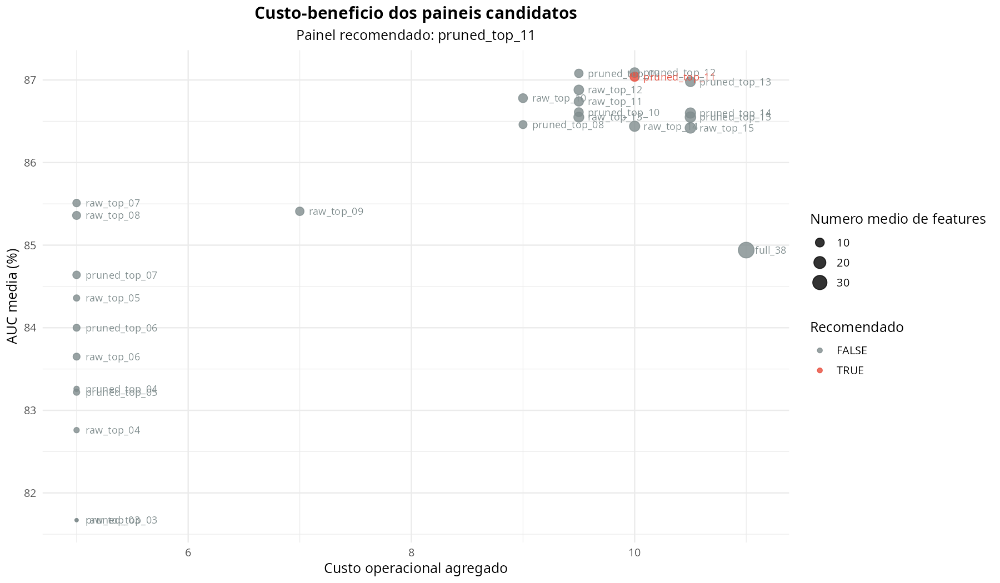

```{r}
knitr::kable(head(resumo_global[, c('Painel_Base', 'Acuracia', 'Sensibilidade', 'F1', 'AUC', 'N_Features', 'Custo_Total', 'Elegivel', 'Recomendado')], 15), digits = 2, caption = 'Resumo global dos painéis candidatos')
```

## Conclusão objetiva

`r ctx$conclusao_necessidade`

`r ctx$texto_painel_recomendado`

`r ctx$texto_custo_recomendado`

# Por que o painel recomendado faz sentido

```{r, results='asis'}
cat(ctx$texto_realidade)
```

## Justificativa feature por feature

```{r, results='asis'}
cat(ctx$texto_justificativas_painel)
```

# Desempenho dos 9 modelos no painel de referência interno

## Cenário 80/20

```{r}
knitr::kable(painel_referencia_final_8020[, c('Modelo', 'Acuracia', 'Sensibilidade', 'Especificidade', 'Precisao', 'F1', 'AUC', 'Acc_CV')], digits = 2, caption = 'Painel de referência interno - cenário 80/20 (revalidado com 10-fold CV)')
```

## Cenário 70/30

```{r}
knitr::kable(painel_referencia_final_7030[, c('Modelo', 'Acuracia', 'Sensibilidade', 'Especificidade', 'Precisao', 'F1', 'AUC', 'Acc_CV')], digits = 2, caption = 'Painel de referência interno - cenário 70/30 (revalidado com 10-fold CV)')
```

## Painel recomendado (revalidado com 10-fold CV)

```{r}
knitr::kable(painel_final_8020[, c('Modelo', 'Acuracia', 'Sensibilidade', 'Especificidade', 'Precisao', 'F1', 'AUC', 'Acc_CV')], digits = 2, caption = 'Painel recomendado - cenário 80/20')
```

```{r}
knitr::kable(painel_final_7030[, c('Modelo', 'Acuracia', 'Sensibilidade', 'Especificidade', 'Precisao', 'F1', 'AUC', 'Acc_CV')], digits = 2, caption = 'Painel recomendado - cenário 70/30')
```

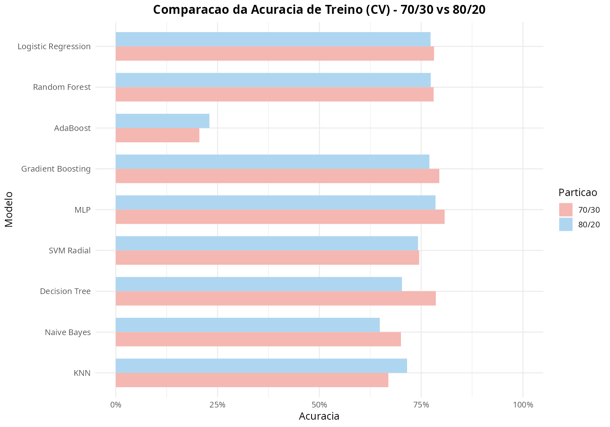

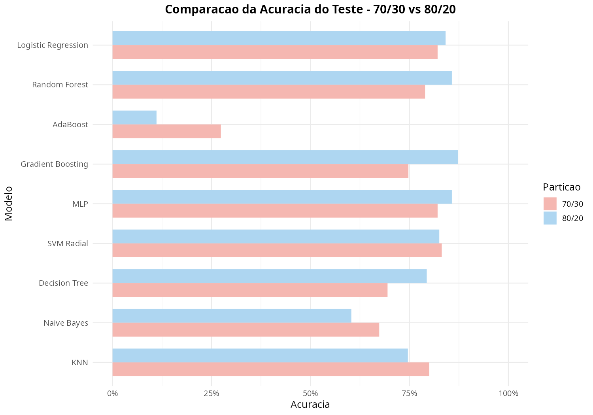

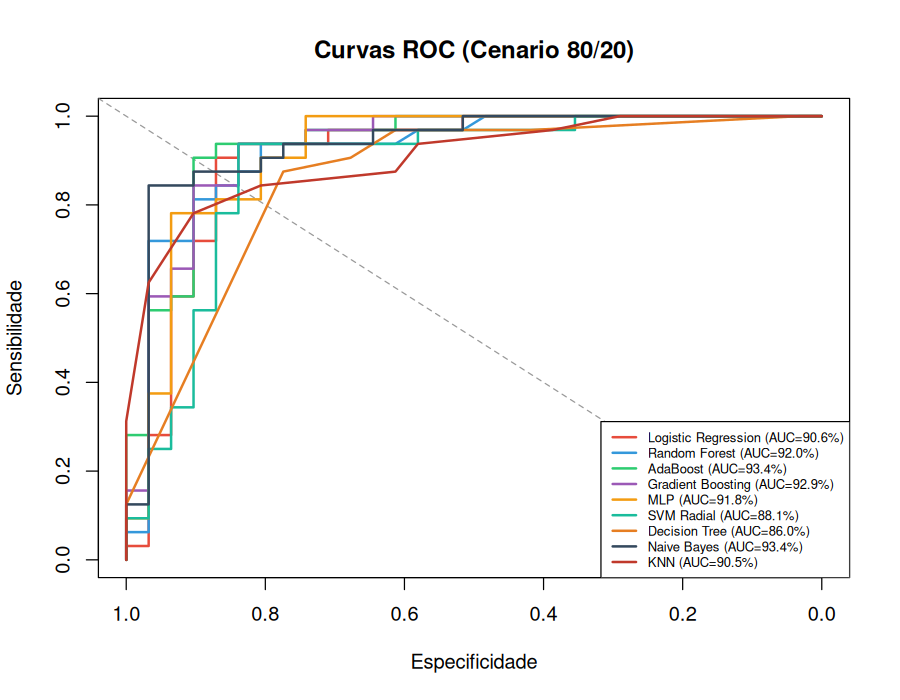

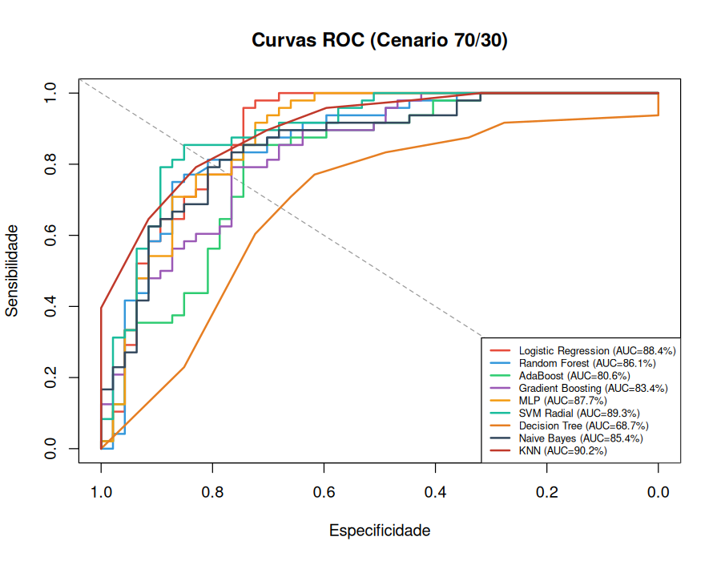

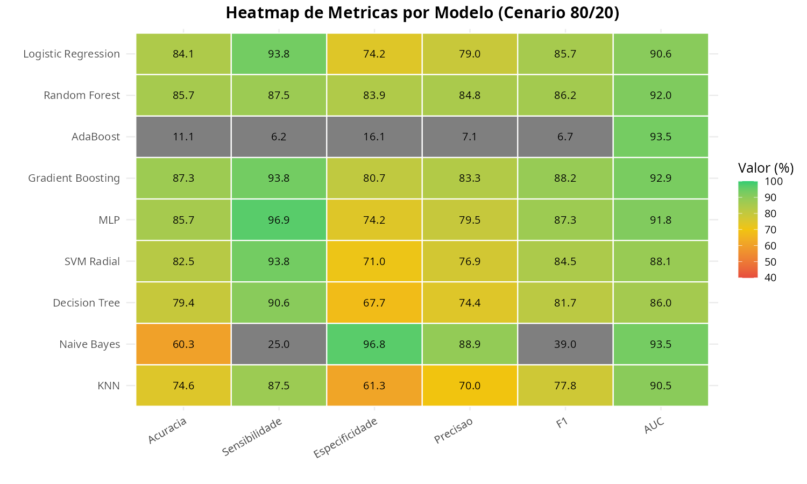

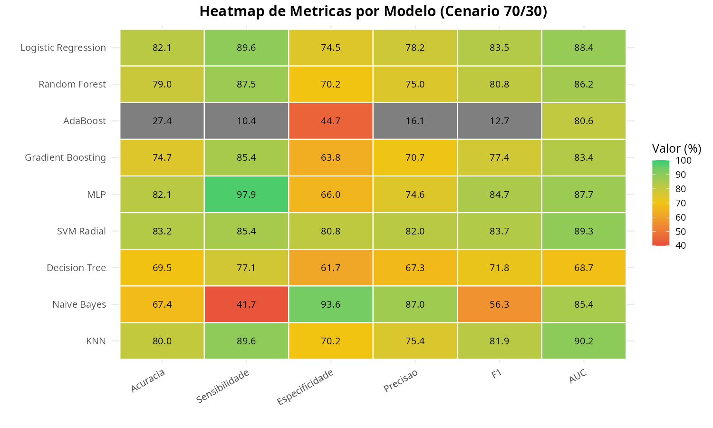

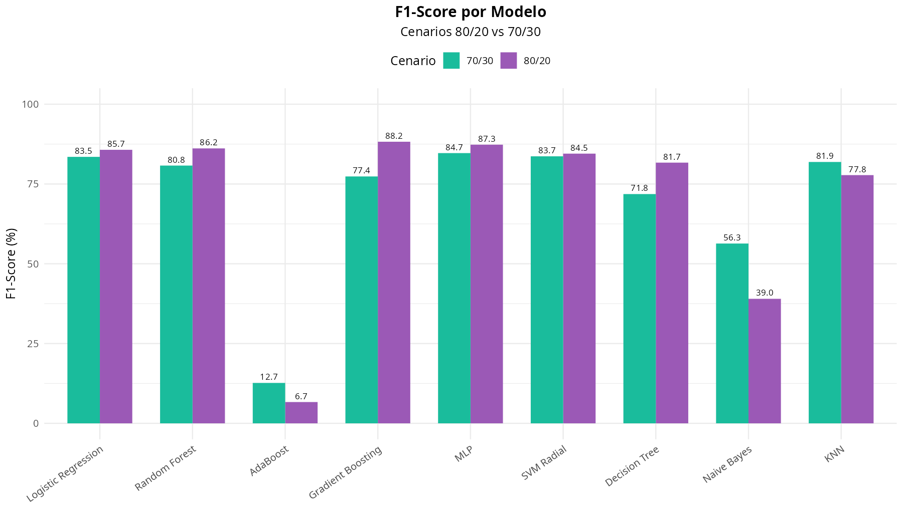

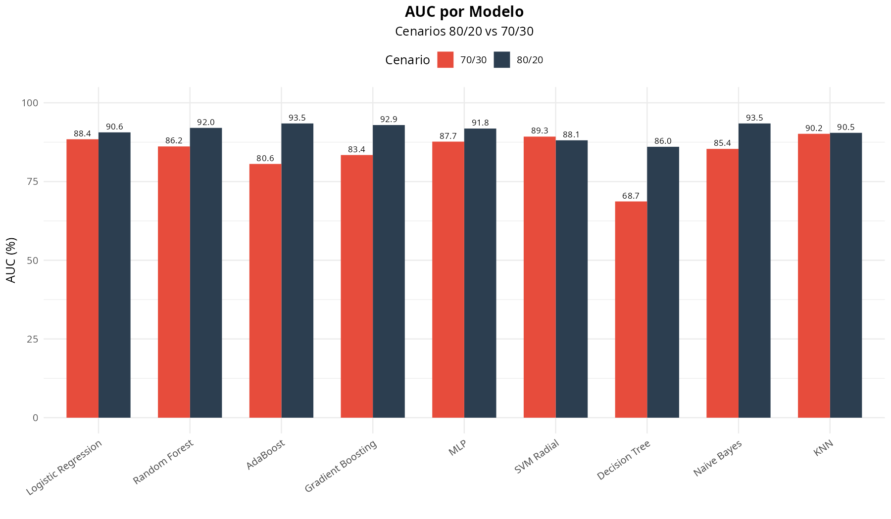

# Faz sentido com a vida real?

Sim, se a interpretação for de **suporte à triagem**. O relatório não assume causalidade e não vende o modelo como substituto de imagem. O ponto central é que um painel pequeno, estável e de menor custo operacional costuma ser mais útil na prática do que um painel maior cuja melhora média é marginal.

Também há um cuidado importante: **variável preditiva não é automaticamente fator de risco epidemiológico**. Obesidade, metabolismo lipídico, diabetes e inflamação continuam clinicamente relevantes mesmo quando uma variável específica não aparece no topo do ranking em todos os splits.

# Limitações

- Base pequena e de centro único.
- Possível instabilidade de ranking em amostra tabular curta.
- Algumas variáveis de bioimpedância são fortemente redundantes.
- O painel recomendado otimiza custo-benefício interno da base, mas não valida generalização externa.

# Referências

- UCI ML Repository: https://archive.ics.uci.edu/dataset/1150/gallstone-1
- Referência clínica oficial: https://www.niddk.nih.gov/health-information/digestive-diseases/gallstones/symptoms-causes
